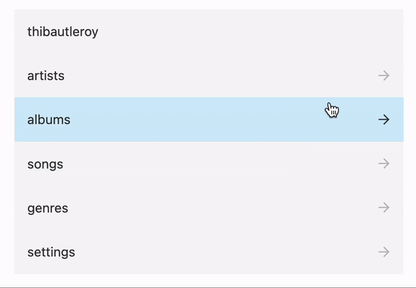

# React Slinky

Slinky library made with React.



## Example

```JSX
<ReactSlinky items={data}  />
```

### data structure

The data should be an array of item object.

Here is the item object structure.

| key   | type                         |
| ----- | ---------------------------- |
| id    | int                          |
| label | string                       |
| link  | string **or** array of items |
